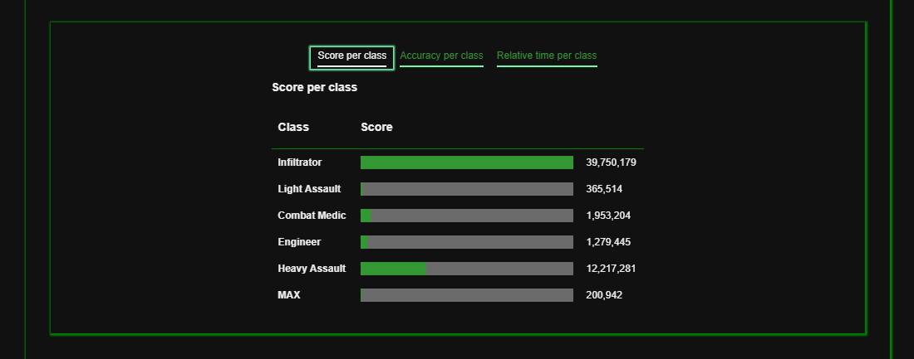

# PlanetSide Stats
*By Sean McLaughlan - [Visit PlanetSide Stats](https://psstats.herokuapp.com/)*

**Table of Contents**
- [PlanetSide Stats](#planetside-stats)
  - [PlanetSide Stats at a Glance](#planetside-stats-at-a-glance)
    - [Leaderboards](#leaderboards)
    - [Search](#search)
    - [Character or outfit stats](#character-or-outfit-stats)
    - [Classes Information](#classes-information)
  - [Front-end](#front-end)
    - [React](#react)
    - [Auth0](#auth0)
    - [Grommet](#grommet)
  - [Back-end](#back-end)
    - [PostgreSQL](#postgresql)
    - [PlanetSide 2's API](#planetside-2s-api)
  - [Conclusion](#conclusion)

## PlanetSide Stats at a Glance

This project utilizes the Planetside2 API to make information and statistics from the game easily accessible.

### Leaderboards

Displays players with highest rankings in categories.


### Search

Find characters and outfits (groups of players).


### Character or outfit stats

After finding a character or outfit, clicking the name will open the stats page.

The stats for a character include primary class, faction, score, accuracy, etc.


The stats for an outfit include member count, faction, and basic information about the characters within the outfit.


Clicking the headers on the table will sort by that column.


### Classes Information

There is a page for general information about character classes as well.


<!-- * [Feature list](https://github.com/smclaughlan/psstats/blob/master/documentation/feature-list/features.md)
* [Components](https://github.com/smclaughlan/psstats/blob/master/documentation/feature-packet/components.md) -->

## Front-end
The front-end utilizes JavaScript, React, and Grommet.

### React
React gives PlanetSide Stats quick navigation.

### Auth0
Auth0 is used for logging in users with their accounts on popular services such as Google. This also means user data doesn't need to be saved to the database.

### Grommet
Grommet is a React component library that PlanetSide Stats makes heavy use of in displaying stats. The DataTable and Meter components were especially helpful in this case.



```jsx
//CharacterClassScore.js
return (stats ?
    <Box>
      <h3>Score per class</h3>
      <DataTable
        columns={[
          {
            property: 'name',
            header: <h3>Class</h3>,
            primary: true,
          },
          {
            property: 'value',
            header: <h3>Score</h3>,
            render: datum => (
              <Box pad={{ vertical: 'xsmall' }}>
                <Meter
                  values={[{ value: datum.value }]}
                  thickness="medium"
                  size="medium"
                  max={getHighestScore(stats)}
                />
              </Box>
            ),
          },
          {
            property: 'valueWithCommas',
            header: '',
          }
        ]}
        data={getChartData(stats)}
      />
    </Box>
    :
    <Loading />)
```

## Back-end
The back-end is a light Node Express server, and primarily needed to provide security for the the API key and handling comments.

### PostgreSQL
The database for this project only holds comments as the vast majority of the information comes from the API mentioned below.

### PlanetSide 2's API
The PlanetSide 2 API offers the raw data seen on the site. It is unfortunately the bottleneck to the site's speed, causing some pages to take longer to reload.

```js
router.get('/outfit/:id', cors(), async function (req, res, next) { //get specific outfit info
  const outfitId = req.params.id;
  const result = await fetch(`http://census.daybreakgames.com/${process.env.API}/get/ps2:v2/outfit?c:resolve=member_online_status,member_character(times.minutes_played,character_id,member_since_date,battle_rank,prestige_level,name.first,certs.earned_points,certs.gifted_points,profile_id)&c:join=type:profile%5Eon:members.profile_id%5Eto:profile_id%5Elist:1%5Eshow:name.en%27image_path%5Einject_at:main_class&c:join=type:characters_stat_history%5Eon:members.character_id%5Eto:character_id%5Elist:1%5Eshow:stat_name%27all_time%5Einject_at:stats_history%5Eterms:stat_name=deaths%27stat_name=kills&c:join=characters_stat%5Eon:members.character_id%5Eto:character_id%5Elist:1%5Eshow:stat_name%27value_forever%27profile_id%5Elist:1%5Einject_at:stats%5Eterms:stat_name=score%27stat_name=hit_count%27stat_name=fire_count(profile%5Eon:profile_id%5Eto:profile_type_id%5Eshow:name.en%5Einject_at:class)&outfit_id=${outfitId}&c:resolve=member_online_status(online_status),member_character(battle_rank)&c:hide=character_id,member_since`);
  if (result.ok) {
    const resJson = await result.json();
    res.send(resJson);
  }
});
```

The requests for the API can get quite complicated and I reached out to some other people who were also working with it. Together, we were able to get all the necessary data we needed for our respective projects.

## Conclusion
My focus with this project was learning more about React. I used it as an opportunity to use functional components with hooks and the Grommet component library.
