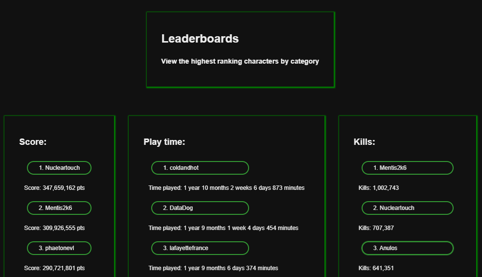
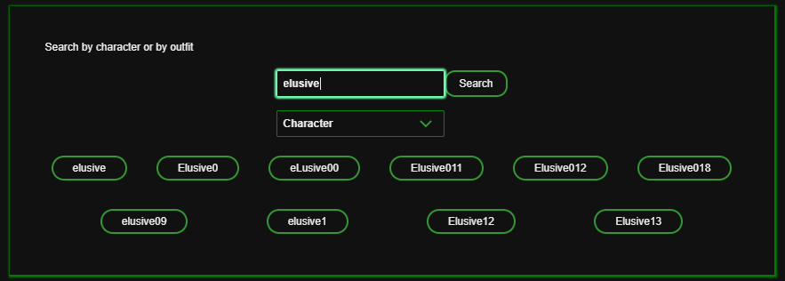
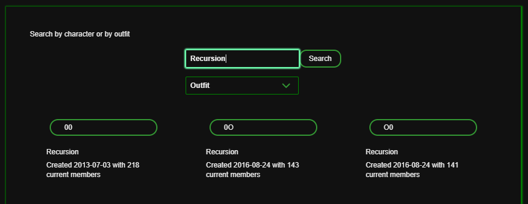
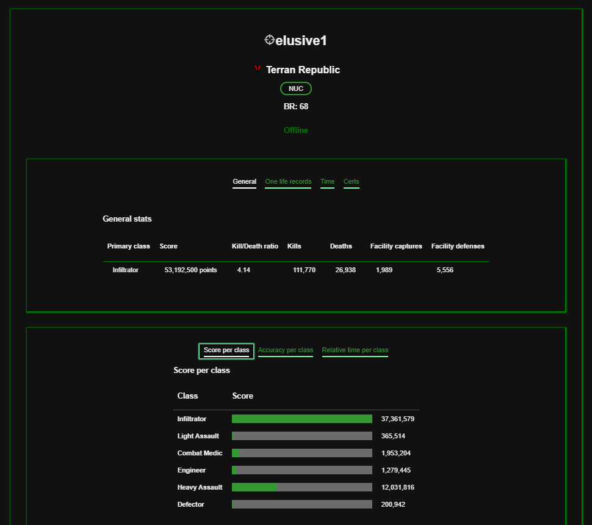
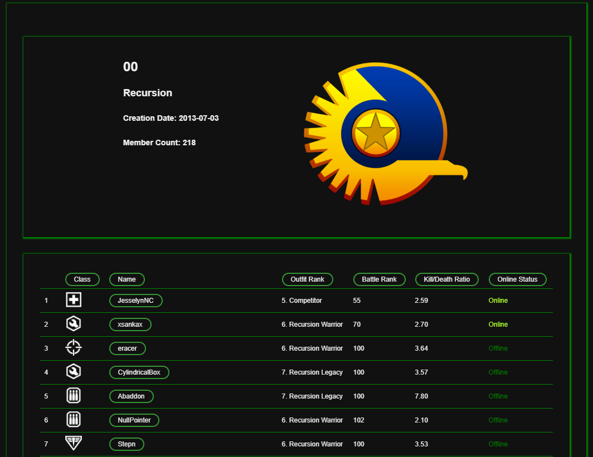
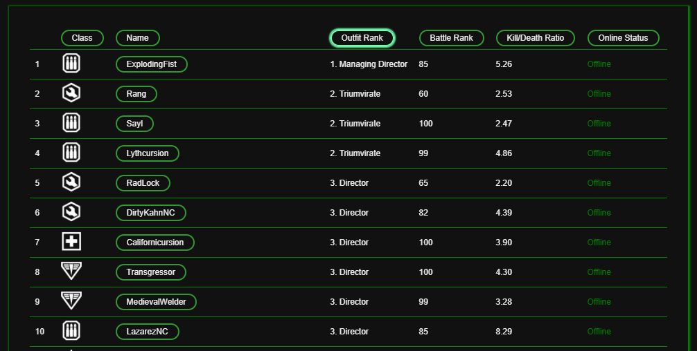
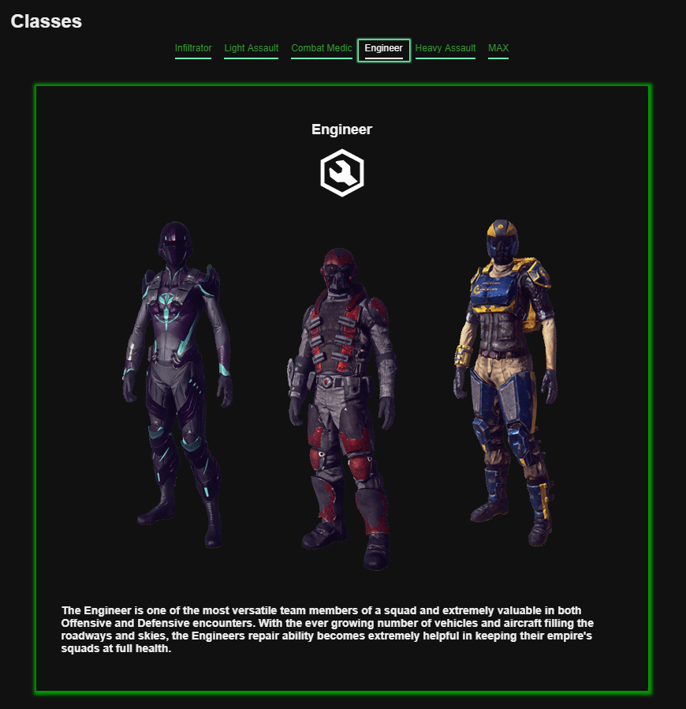

# PlanetSide Stats
*By Sean McLaughlan - [Visit PlanetSide Stats](https://psstats.herokuapp.com/)*

**Table of Contents**
- [PlanetSide Stats](#planetside-stats)
  - [PlanetSide Stats at a Glance](#planetside-stats-at-a-glance)
    - [Leaderboards](#leaderboards)
    - [Search](#search)
    - [Character or outfit stats](#character-or-outfit-stats)
    - [Classes Information](#classes-information)
  - [Front-end](#front-end)
    - [React](#react)
    - [Grommet](#grommet)
  - [Back-end](#back-end)
    - [PostgreSQL](#postgresql)
    - [PlanetSide 2's API](#planetside-2s-api)
  - [Conclusion](#conclusion)

## PlanetSide Stats at a Glance

This project utilizes the Planetside2 API to make information and statistics from the game easily accessible.

### Leaderboards

Displays players with highest rankings in categories.

### Search

Find characters and outfits (groups of players).

### Character or outfit stats

After finding a character or outfit, clicking the name will open the stats page.

The stats for a character include primary class, faction, score, accuracy, etc.

The stats for an outfit include member count, faction, and basic information about the characters within the outfit.

Clicking the headers on the table will sort by that column.

### Classes Information

There is a page for general information about character classes as well.

<!-- * [Feature list](https://github.com/smclaughlan/psstats/blob/master/documentation/feature-list/features.md)
* [Components](https://github.com/smclaughlan/psstats/blob/master/documentation/feature-packet/components.md) -->

## Front-end
The front-end utilizes JavaScript, React, and Grommet.

### React

### Grommet

## Back-end

### PostgreSQL

### PlanetSide 2's API

## Conclusion

- about learning react
- learning to use grommet, display charts/data
